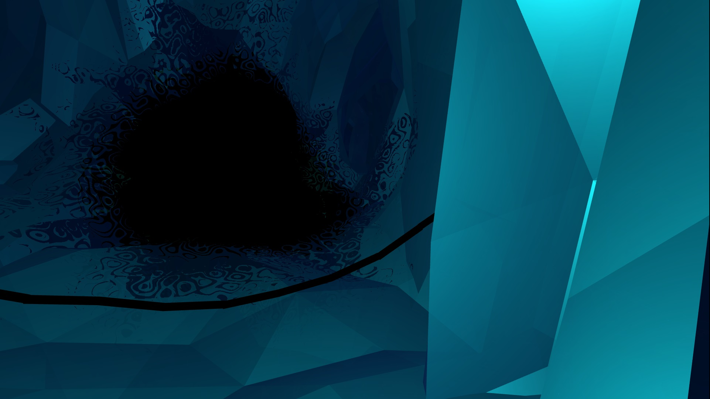
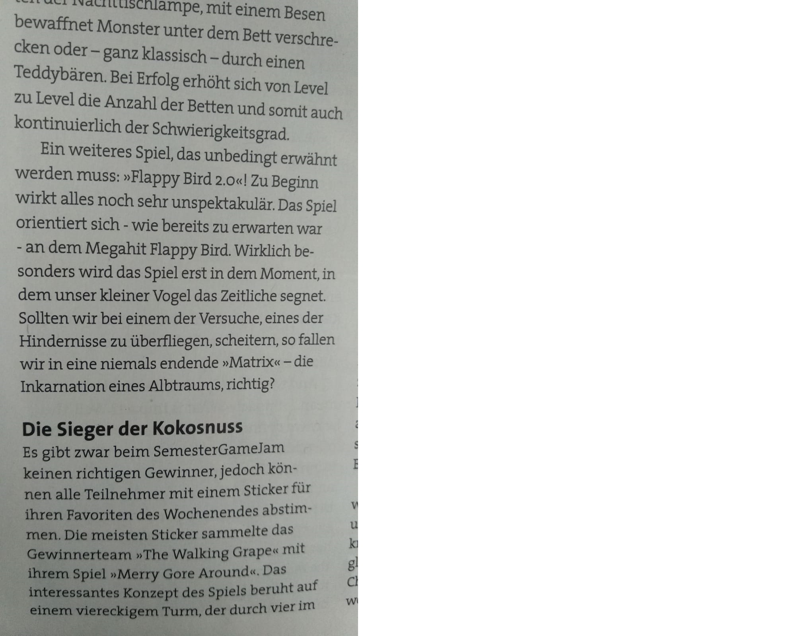

# Portfolio
Unity projects, links to my shadertoy profile, and what else I can think of putting here.

## Age of Empires Game Design:
Some game design documents featuring some small and large scale example ideas for Age of Empires 2.
Of course proper GDDs would be a collaboration of several game designers and updated over the iterations by a whole development team, but this would be a first draft to start from, add and improve upon. 

 
### Small ideas
Probably implementable by a single dev, but hopefully still with a noticeable positive impact on gameplay.

#### Sum carried resources for selected groups 
Making a group of villagers show the sum of the resources they carry instead just showing nothing. 

Desired impact: Players no longer need to individually cycle through their villagers when they need to reach a specific amount of food asap (Villager, Feudal research, Castle research). 

Impacted gameplay: Eco in Dark age, minimally in feudal age 

#### Making global queue items cancellable
Right clicking on something in the global unit queue directly cancels it, instead of requiring players to left click it (at the top left) and then cancel it (in the bottom middle).

Desired impact: Misclicking militia while shift spamming halbs doesnt force the player to cycle through his barracks to cancel each individually

Impacted gameplay: Military Imp/Post Imp

#### Cavalry charge sound effect when a big group of cavalry attack moves towards a big group of enemies
Similar to the charge sound effect in AoM, but more sparsely triggered and only some slight horse gallop sound to not disturb important sound clues.
Desired impact: Give the player a feeling of power while commanding a group of knights, without disturbing the rest of their gameplay experience

Impacted gameplay: No game mechanics changed, audio experience only 

### Big ideas
Ideas that would require proper project setup and management and could also change too much and break with some of the traditional aoe2 game feel

## Continuous Map tournament: 
This is a pretty outlandish idea and more an example of what breaks if you disrupt the existing systems with a big change
The Tournament starts out with a conventional 1v1 on a tiny map, but the winner is not just matched against another winner, their final state of the map is also saved and combined into a rectangular new meta map, where many  

## Game jam projects:

### Ered Engrin 
Third Place among 138 participants, topic: Discovery

An atmospheric maze runner game about a mysterious ice cave.

Mysterious monster and xray shader coding, general unity coding and game design.

Can be played by downloading the .zip and starting the EredEngrin.exe in the folder, or use the EredEngrin folder directly if the full repo is already downloaded. 

The full repository with code is found at:

 https://github.com/Wacken/Cooles-Guldr-ber-Spiel

### Flappybird 2.0
Glitch style shader coding, general unity coding like an eternally vertically looping world and game design.

Honorable mentions by the jury and an article in a newspaper (in german)

Trailer: https://www.youtube.com/watch?v=cWZ3SMBPXlU
 https://shytea.itch.io/flappybird2

### Alien Dating Simulator
Honorable mentions by jury
Procedural generation of aliens, creating all of the UI necessary for the Dating sim, game design.
Project unfortunately lost to the ages (and Unity Collab)

### Brainfuck Planet
Third Place among 94 participants, topic: Depth

Some shader coding, general unity coding, game and level design.
 https://github.com/SpicedPigeon/BrainfuckPlanet (requires 3+ year old Unity 5.6)

And 3 more, each time with a different team and slightly different tasks.

