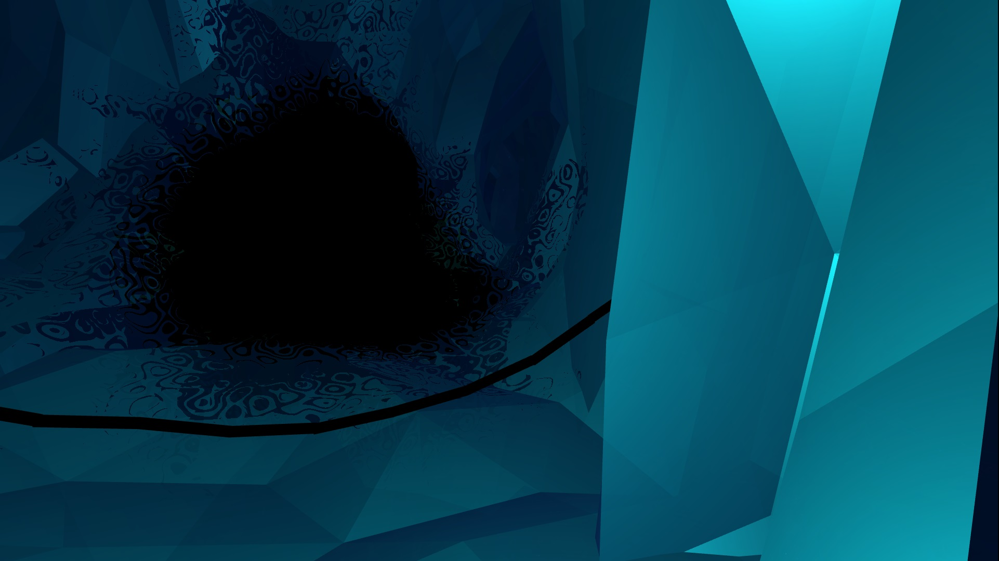

# Portfolio
Unity projects, links to my shadertoy profile, and whatever else I can think of putting here.

#Age of Empires Game Design:

## 

# Game jam projects:

## Ered Engrin 
3. Place
Mysterious monster and xray shader coding, general unity coding and game design
 https://github.com/Wacken/Cooles-Guldr-ber-Spiel

## Flappybird 2.0
Glitch style shader coding, general unity coding like an eternally vertically looping world and game design
Honorable mentions by jury
Trailer: https://www.youtube.com/watch?v=cWZ3SMBPXlU
 https://shytea.itch.io/flappybird2

## Alien Dating Simulator
Honorable mentions by jury
Procedural generation of aliens, creating all of the UI necessary for the Dating sim, game design
Project unfortunately lost to Unity Collab

## Brainfuck Planet
3. Place
Some shader coding, general unity coding, game and level design
 https://github.com/SpicedPigeon/BrainfuckPlanet (requires 3+ year old Unity 5.6)

And 3 more, each time with a different team and slightly different tasks.

