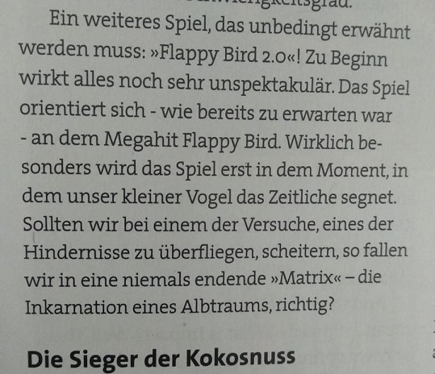
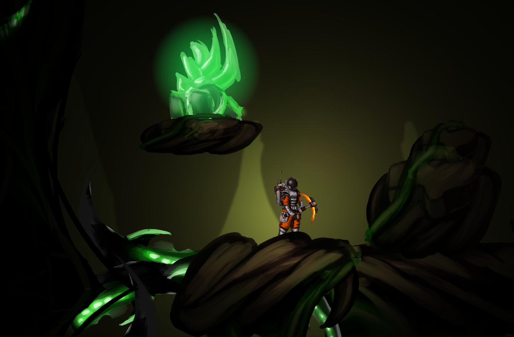

# Portfolio
Unity projects, link to my [shadertoy profile](https://www.shadertoy.com/user/Jarazz), and what else I remember to put here. 

## [Age of Empires Game Design](/AoE/AoE_doc.md):

  

A collection of game design document examples featuring some small change and civ expansion example ideas for Age of Empires 2 are found [here](/AoE/AoE_doc.md). 

## Game jam projects:

### Ered Engrin 
Third Place among 138 participants, topic: Discovery

An atmospheric maze runner game about a mysterious ice cave.

Mysterious monster and xray shader coding, general unity coding and game design.

Can be played by downloading [EredEngrin.zip](/EredEngrin.zip) and starting the EredEngrin.exe in the folder. 

 
  

The full repository with code is found at:
 https://github.com/Wacken/Cooles-Guldr-ber-Spiel

### Flappybird 2.0
Glitch style shader coding, general unity coding, like an eternally vertically looping world, and game design.
 
Honorable mentions by the jury and an article in a newspaper (in german) 

 

[Trailer:](https://www.youtube.com/watch?v=cWZ3SMBPXlU)

On itch.io:

 https://shytea.itch.io/flappybird2

### Galactinder
Alien Dating Simulator with an honorable mention by the gamejam jury 

Procedural generation of 2D aliens (up to 36000), creating all of the UI necessary for the dating sim, game design. 

The first part of the game about a dating app with procedural aliens was designed and programmed by [Feli](https://twitter.com/Niodith), Leo and me, with great art made by [Kris](https://twitter.com/kris_weinand).

The second part, travelling to the date as a 2D spaceship minigame was made by two other games engineer students.

  

The procedural name generation with 5400 permutations I quickly hacked together is a great example of how a little can achieve a lot.

  

Can be played by downloading [Galactinder.zip](/Galactinder.zip) and starting the AltGalactinderBuild.exe in the folder. 

 

### Brainfuck Planet
Third Place among 94 participants, topic: Depth

  

Some shader coding, general unity coding, game and level design.

 https://github.com/SpicedPigeon/BrainfuckPlanet (requires 3+ year old Unity 5.6)

And 3 more, each time with a different team and slightly different tasks.

